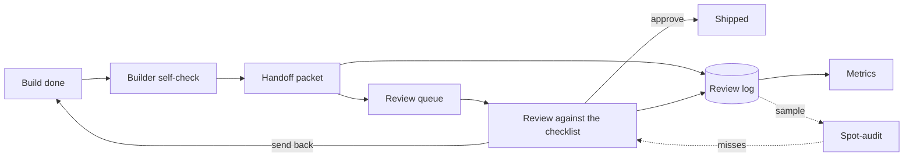

# Field Guide (v2)

## What this is

One person, seven weeks, one artifact a day, running 2026-06-22 to 2026-08-09, after which the cadence stops. Most of it builds one system: a review loop that carries an automation from "someone says it is done" to a decision a team can stand behind. A build here means one working automation, often assembled with a model's help, that somebody wants to put in front of other people.

## The loop in five sentences, and drawn

A builder finishes something and runs a self-check against a published bar. The builder assembles a handoff packet, which enters a queue where somebody other than the builder is assigned to it. The reviewer works the checklist line by line and lands on approve, approve with fixes, or send back, and the filled copy goes back as the message. Every trip writes one row to the review log, and three of the four metrics are read off those rows. A third person samples decided builds and re-reviews them cold, because a reviewer who approves everything produces metrics that look excellent.

Solid lines are the path a build travels. Dotted lines are the loop inspecting itself.

## The ten files that matter

Read the first three in order. The rest answer a question you hit later.

| File | What it is for |
| --- | --- |
| [Automation Standards](standards/automation-standards.md) | The bar a build is judged against, used by both sides |
| [AI Build Review Checklist](governance/ai-build-review-checklist.md) | The gate that turns that bar into one of three outcomes |
| [SOP: Run a Build Review](sops/run-a-build-review.md) | How a reviewer works, so two people reach the same call |
| [Builder Self-Check Before Handoff](enablement/builder-self-check.md) | The prep only the builder can do |
| [SOP: Hand Off a Build for Review](sops/hand-off-a-build-for-review.md) | What goes in the packet, and how the decision comes back |
| [The Review Log](sops/review-log-spec.md) | The permanent record, one row per handoff |
| [SOP: Run the Review Queue](sops/run-the-review-queue.md) | Ordering, assignment, and the floor of three people |
| [Metric Definitions](analytics/metric-definitions.md) | Four metrics and what each one is blind to |
| [Review Spot-Audit](governance/review-spot-audit.md) | The guardrail on the reviewer, a sample re-reviewed cold |
| [Where a Human Stays in the Loop](enablement/where-a-human-stays-in-the-loop.md) | Where a person reads model output on a build that calls a model |

## What is real and what is synthetic

Nothing here has run with a real team: no queue anyone pulled from, no build handed to a second person, no audit by a third.

Synthetic means authored to exercise a definition, and labeled that way wherever it appears. That covers every build name, every row in every log and queue, every worked example under a metric, and all three worked runs. One of them, [a rubber-stamped approval](examples/a-rubber-stamped-approval.md), walks a flaw past two people and lets the audit catch it.

Real means it happened here, on a date, and you can check it in the tree. The standards, checklists, and procedures were written, versioned, and revised, though most of the files that call themselves living documents never left v1: 7 of 34 when [the census](analytics/the-repo-by-the-numbers.md) counted them, 12 of 36 once the corrections that followed the run had landed. [The index check](checks/README.md), the script and CI that fail when a file exists in the tree but is missing from [the ordered index](sops/the-review-loop-in-order.md), is 217 lines of Python on a 19-line workflow, and both run. [The handoff intake](automations/handoff-intake/README.md), one workflow of 8 functional nodes in n8n, an automation tool, tests a submitted packet against the fields the handoff SOP requires and returns an incomplete one to the builder. It shipped failing four lines of this repo's own checklist, each written up beside the build with its fix, and none of the four is fixed. The counts are real too, each with the command that produces it. Taken the morning this page was written, before it and its entry existed: 91,006 words across 89 markdown files, 47 of them daily entries and 6 weekly logs, with 24 procedure and governance pieces in the ordered index. The Repo by the Numbers is the census those commands come from, taken a day earlier and two files lower.

## What broke, and what actually caught it

The index check's first run exited 1 and found two genuinely unindexed files. Both had been named in writing, in advance, as the first things that rule would catch.

The CI fired only on push, so it would have stopped firing the moment the repo was finished, which is the week it starts mattering. The gap surfaced while [the maintenance policy](governance/maintenance-policy.md), the ruling on what this repo owes once the cadence ends, was being written; a weekly schedule landed that day.

The review log spec, sixth in the table above, told readers to keep four required columns while its own field list showed five. That survived seventeen days and two version bumps, in the file the review side opens most often. [check_index.py](checks/check_index.py) tests paths, headings, scope, and a tally. No check here reads prose for internal contradiction.

One of the three was caught by a control. The other two were caught by a person writing about something else. One found error implies an unknown number of unfound ones.

## If you want to use it

Take the standard, the checklist, and the reviewer's steps first, under three thousand words together. Add the self-check, then the log, then the queue, then the metrics, each when the pain it answers shows up. The audit is the exception and goes on a calendar, because a reviewer who stops looking shows up as a clean record. [Lifting This Into a Real Team](enablement/lifting-this-into-a-real-team.md) names what to rename before the first handoff and the six things that break in the first two weeks.

## What this does not prove

One person writing both sides of a review will always write two sides that agree. That gap closes one way only: somebody runs the loop with a team and reports what broke. The maintenance policy makes that the first condition for reopening the work, and names what comes out of it, revisions to the handoff SOP, the reviewer SOP, and the checklist, versioned and citing the report.

## Where to go next

Ten minutes: this page and the diagram. An hour: the standard, the checklist, and the reviewer's steps. A weekend: the ordered index, every piece listed by when you need it, plus [one worked run](examples/a-build-through-the-loop.md). If you take this somewhere and it breaks, that report is the most valuable thing anyone could add here.

## What changed in v2

- Corrected the revision ratio. It read 7 of 34 files ever leaving v1, which was true when the census
  measured it and sat outside the as-of note that covers the counts later in the same paragraph. The
  corrections made after the run moved it to 12 of 36, so the line now carries both figures and says
  what moved between them.

---

*v2. A living guide. The next pass swaps a worked run for a real one, if somebody runs this with a team and writes back.*
