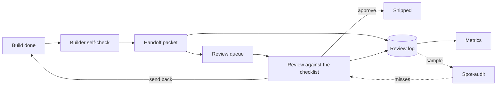

# AI Ops in Public

A daily log of building, governing, and operationalizing AI-powered automation: one real artifact a
day since 2026-06-22, on a fixed rotation of Build, Govern, Enable, Document, Analyze, Integrate,
Reflect. The aim is operational maturity, not demos. Most of what is here builds one system, a review
loop that takes an automation from "someone says it is done" to a decision a team can stand behind.

## The loop

A finished build travels from done to shipped through a self-check, a handoff, and a reviewed
decision. The log records every trip, the metrics read the log, and the spot-audit samples the
decisions to check that the reviews themselves hold up.

## Start here

1. [The review loop, in order](sops/the-review-loop-in-order.md): every piece of the system, ordered
   by when you would need it. If you read one thing, read this.
2. [The index check](checks/README.md): the script and CI that keep that page honest, including the
   first run, which failed and caught real drift.
3. [A populated log and queue](examples/a-populated-log-and-queue.md): the two records with rows in
   them, and three metrics computed off the rows by hand.
4. [The automation standard](standards/automation-standards.md) and
   [the review checklist](governance/ai-build-review-checklist.md): the pair a team could lift today,
   each under a thousand words.
5. [A rubber-stamped approval](examples/a-rubber-stamped-approval.md): the failure the metrics cannot
   see, and the guardrail that catches it.

## Ground rules

Everything here runs on synthetic data, authored to exercise the definitions; no employer or client
material appears anywhere, by design. Every document states its own limits once, next to what was
done about them.

## The five pillars

Anyone running AI inside a team has to do five things well, and this repo grows one piece of each:

- **Build** automations that are reliable, not only clever.
- **Govern** them: review gates, guardrails, checks that run.
- **Enable** people: adoption models, coaching guides, onboarding.
- **Document** everything into reusable SOPs and standards.
- **Analyze** usage and turn it into decisions.

## Layout

| Folder | What lives here |
|--------|-----------------|
| [`standards/`](standards/) | The engineering baseline builds are judged against |
| [`governance/`](governance/) | Review gates, guardrails, and rulings |
| [`enablement/`](enablement/) | Guides for the people running the loop |
| [`sops/`](sops/) | Procedures, record specs, and the start-here index |
| [`analytics/`](analytics/) | Metric definitions and memos on what to measure |
| [`integration/`](integration/) | Weekly maps that tie each week's pieces into one system |
| [`examples/`](examples/) | End-to-end runs of the loop on synthetic builds |
| [`checks/`](checks/) | The script and CI that verify the repo's own claims |
| [`daily/`](daily/) | The running narrative, one entry per day |
| [`log/`](log/) | Weekly syntheses of what was learned |

Maintained by Kevin Yu · [github.com/exekyute](https://github.com/exekyute).

## License

MIT. See [LICENSE](LICENSE).
