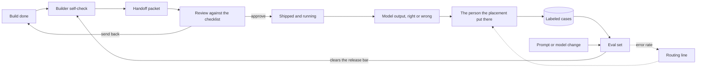

# The Loop Meets the Model (v1)

This week shipped five pieces: a script, the workflow that runs it on every push, a design-time decision about where a person reads model output, a change rule that reaches a prompt, and a memo on what a saved graded set can tell you. Two assumptions had been holding this repo up, and the week broke both. The first is that a control is real once it is written down. Four index rules had sat in a memo with nothing running them, and a rule with no enforcer is a rule nobody has to keep. The second is that a build is finished once it is approved. A build with a model step in it never is. This file is that map, and it continues last week's, where the agenda came from use: writing twelve log rows broke a spec nobody had noticed was ambiguous. This week's came from the repo's own writing. One piece answered a limit an earlier footer confessed, two answered limits this same week's files opened days apart, and two closed gaps that had been sitting inside shipped rules with nobody writing them down. A repo that records its limits builds a backlog it can see. A repo that writes rules without enforcers builds one it cannot.

## The loop

The week has two halves with different subjects. The first two stages are the repo itself, where a described control became a running one. The last three are a build, where the loop met a component that does not hold still.

1. **Run the rule that was only written down.** [The index check](../checks/check_index.py) implements four rules over [the review-loop index](../sops/the-review-loop-in-order.md), the start-here page for the review side. [The measure-or-test memo](../analytics/measure-or-test.md), the ruling on when a question wants a number and when it wants a test, had specified all four. Two of them were run once by hand on the day the index shipped and never again; the other two had never run at all. The first run exited 1, and [the check's notes](../checks/README.md) record what it found: two rules failed, both on real drift, and both files rule 3 named had said in writing, in advance, that they would be the first things caught. Three more breaks were planted and reverted, since a check that has only ever passed is one nobody should trust.
   *Piece:* `checks/check_index.py`.

2. **Take the running off memory.** [The CI workflow](../.github/workflows/checks.yml) runs the script on every push and pull request, so a broken pointer now fails the build in public, and the check's own "nothing runs it automatically" limit was deleted before it was a week old. The queued question had been whether to write "run the check" into [the automation standard](../standards/automation-standards.md), the baseline every build here is judged against. Sixteen lines of YAML cost less than the paragraph arguing for the rule.
   *Piece:* `.github/workflows/checks.yml`.

3. **Decide where the person sits before the first run.** A model that returns a wrong answer in the right shape produces a successful run: the schema validates, nothing raises, and the exception rate scores it clean. [The placement guide](../enablement/where-a-human-stays-in-the-loop.md) asks two design-time questions: what undoing a wrong output takes, and whether anything would notice it. A grid turns the answers into one of four placements, from a machine check only up to a person approving every output before it acts, and the choice goes in one line next to the build. [The review checklist](../governance/ai-build-review-checklist.md) is the gate a build passes before it goes live, and its line about a person being in the loop wherever the stakes are real had never been answerable. It now reads a written claim where it used to record a reviewer's nerve.
   *Piece:* `enablement/where-a-human-stays-in-the-loop.md`.

4. **Put the configuration under the change rule.** Someone rewrites two sentences of a prompt in a text box and saves. From the next run the build decides differently, with no diff and no author. Section 9 of the standard already forbade editing production blind, in words written for a workflow definition you can export. [The change-control standard](../standards/prompt-and-model-change-control.md) names six items as one unit, prompt text, model id, decoding parameters, tool definitions, output schema, and grounding source, and requires a dated pin so a provider-side change becomes an event. Its structural move is the one this map turns on: a configuration change is a handoff. It preps against [the builder self-check](../enablement/builder-self-check.md), the prep a builder runs before handing a build off, moves through [the handoff SOP](../sops/hand-off-a-build-for-review.md), the path a build travels to reach a reviewer, and is decided on the checklist against a named subset of lines.
   *Piece:* `standards/prompt-and-model-change-control.md`.

5. **Say what clears a change, and feed back.** The placement guide declined to set a routing threshold and the change standard declined to define the set a change runs against. [The evals memo](../analytics/evals-and-the-review-loop.md) supplies both. The set is two subsets with two bars. A regression list holds every case that ever caused a change, where the bar is all of them and a case leaves only by written retirement. A representative list is drawn to look like live traffic and read as a rate against a threshold. An eval gates a change; a placement gates a run. Record on each representative case the proxy value a routing rule would read, and the set returns an error rate per band, the line the placement guide deferred. That sends you back to stage 3.
   *Piece:* `analytics/evals-and-the-review-loop.md`.

The upper path is the loop as week 2 drew it. The queue, the log, the metrics and the spot-audit that weeks 3 and 4 added are left off so the model half stays readable, and the README carries the full picture. Everything under that row is what a model step adds. The arrow to read runs from the eval back to the self-check. A prompt or model change rejoins the build path where a finished build starts, carries its eval result into the same packet, and reaches the same reviewer working the same checklist. That is a second entrance to one gate rather than a second system beside it. The lower cycle turns at its own tempo, a change at a time, and the dotted return is slower again: an error rate per band sets the routing line, which decides which live outputs reach the person.

The index check and its CI are not on this diagram. They govern the repo's own upkeep, the pointers in one index file, and no build passes through them, so drawing them onto a build diagram would be false.

## The handoffs

Most of the value sits in the seams between the pieces, not in the pieces on their own.

- The **script** is a control and the **workflow** is what makes it one that runs. Either alone is a failure this repo has already named twice: a rule with nothing behind it, or a habit waiting on somebody's memory.
- The **placement** and the **change standard** join at a version. A placement is decided against one prompt and one model, so the recorded line names both, and every change to the six items re-opens the two questions. The answers usually do not move, and recording that they did not is the whole cost.
- The **change standard** hands the **memo** its shape and gets a result back. Its testing section required both configurations to run against the same inputs and declined to define the set. The memo says what the result has to look like inside the handoff packet: every regression case named, both rates with their counts under them, and the outputs that changed listed by name. A rate can hold steady because several cases moved and cancelled out, so what moved is the part a reviewer reads.
- The **placement** feeds the **set**. Placements 2, 3 and 4 each put a person on live output, and a person reading output produces a labeled case, the unit an eval is built from. Placement 1 produces none, so the cheapest placement is the one whose set goes stalest.
- The **memo** closes the ring differently again. Weeks 2 to 4 each ended in a number pointing back at one earlier stage, and week 5 ended in a check whose trigger was the act of editing. This one ends in a saved set feeding two directions, a bar that gates the next change and a threshold that moves where the person sits. Its bound: an eval refutes a detection answer and never establishes one, and no pass rate empties the irreversible column.

## The loop in one line

Run the rules you already wrote down, put the running where memory cannot skip it, decide where a person reads model output before the first run, treat every edit to a prompt or a model id as a handoff into the same gate, and grade that edit against a set the placement's person produced, which sends you back to where that person sits.

## Where this fits in the last five loops

[Week 1's map](week-01-automation-lifecycle.md) laid out the automation lifecycle, of which review is one stage. [Week 2's](week-02-review-and-handoff-loop.md) opened that stage into a loop of its own, [week 3's](week-03-the-loop-watching-itself.md) wrapped a second loop around the review, [week 4's](week-04-the-loop-needs-people.md) ran that stack with a pool of people, and [week 5's](week-05-the-loop-gets-kept.md) found that keeping what those weeks wrote is work the system generates on its own.

Week 6 is where the loop met a component built on different assumptions. It already knew how to take a changed build back: [the handoff ruling](../governance/what-counts-as-one-handoff.md), which settles what counts as one trip through review, sends new work on a shipped build around again as a fresh handoff carrying its own row. What it assumed is that a change has an author, a diff, and a date. A model step breaks that three ways. The same input can produce a different output, a prompt edit leaves nothing to diff, and a floating alias repoints with no edit at all. A review that passed describes a version rather than a build, which is why a configuration change has to re-enter at the handoff and why a placement carries the version it was decided against.

The pillar slot for each day was fixed in advance as it is every week. What filled them came from the repo's own writing, in two grades. A footer that confesses a limit hands you a task you can see coming, and finding it costs nothing. A rule shipped with nothing running it, or written for a thing it has stopped covering, hands you one nobody had noticed was owed. Two of this week's five were the second kind, and those two are the ones that moved the design.

## What is still missing

Each piece is a v1, the check's notes are at v2 after CI deleted one of their limits, and this map is a v1 too. Nothing here has run against a real model step. The placement guide's worked record is an authored email-routing build, no prompt has moved through the change standard end to end, the eval set does not exist, and the repo's two worked build examples are both model-free, one of them marking its model group not applicable.

Grading is the ceiling the memo names and cannot cross. Where the right answer is a team id, the comparison is mechanical. For a drafted email there is no key, so something has to judge quality, and if that judge is a model then it is a review with nobody auditing it. The memo specifies the fix, a person reading a graded sample of the judge's own calls on a cadence. Nobody has built it.

The placement guide and the change standard each end in an edit to a file they do not own, and neither edit has landed. The checklist still asks whether a person is in the loop wherever the stakes are real. The self-check still has four items in its model group and no placement declaration.

What the week did is the thing this repo had described twice and never run. It ran its own check, then took the running off memory, and it carried the review loop onto a component whose failures finish green.

---

*v1. A living map. The next pass runs a prompt change end to end through the packet, builds the first eval set behind the release bar, and lands the two edits this week's new files are waiting on.*
